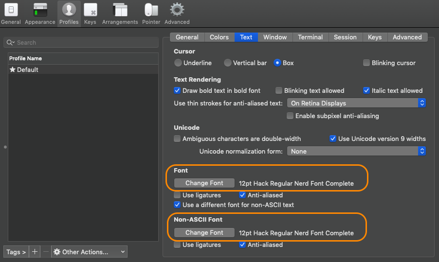

# Setup MacOS Development Environment

## Purpose
This repository documents the applications and dependencies of my macOS development environment.

## System Preferences

Increase accessibility of the Mac Finder with the following commands:

1. Show Library folder:
```bash
chflags nohidden ~/Library
```

2. Show hidden files:
```bash
defaults write com.apple.finder AppleShowAllFiles YES
```

3. Show path bar:
```bash
defaults write com.apple.finder ShowPathbar -bool true
```

4. Show status bar:
```bash
defaults write com.apple.finder ShowStatusBar -bool true
```

5. Go to System Preferences for the following:

- Keyboard > Text > Disable “Correct spelling automatically”
- Keyboard > Text > Disable “Capitalize words automatically”
- Security and Privacy > FileVault > On — makes sure SSD is securely encrypted
- Security and Privacy > Firewall > On
- Security and Privacy > General > Allow App Store and identified developers
- File Sharing > Off


## Install and Configure Homebrew

1. Install [Homebrew](https://brew.sh/)
```bash
/usr/bin/ruby -e "$(curl -fsSL https://raw.githubusercontent.com/Homebrew/install/master/install)"
```

Install applications and dependencies with [Homebrew Bundle](https://github.com/Homebrew/homebrew-bundle)

2. Create `Brewfile`. See [`assets/Brewfile`](assets/Brewfile)
```bash
touch Brewfile
```

3. Install applications and dependencies with:
```bash
brew bundle
```

## Configure the Terminal
1. Setup iTerm2 to use the Nerd font
```
iTerm2 > Preferences > Profiles > Text > Font > Change Font
```
Select **English > Hack Nerd Font > Regular** for both **Font** and **Non-ASCII Font**



2. Install powerlevel9k theme
```bash
git clone https://github.com/bhilburn/powerlevel9k.git ~/powerlevel9k
```

3. Change the default shell to Zsh.
```bash
chsh -s /bin/zsh
```

The Z-shell (Zsh) resource file, `~/.zshrc`, is a script that is run whenever you start Zsh.

4. Configure Zsh. See [`assets/.zshrc`](assets/.zshrc).

5. Download [iterm2colorschemes](https://iterm2colorschemes.com/)

6. Configure iTerm2 Color Preset
```
iTerm2 > Preferences > Profiles > Colors > Color Presets > Dracula
```

## Configure Visual Studio Code
1. Go to the Command Palette and select:
```
Shell Command: Install `code` in PATH
```

2. Install Extensions
- Bracket Pair Colorizer
- CloudFormation
- Color Highlight
- CSS Peek
- Docker
- indent-rainbow
- Indenticator
- Live Server
- Material Icon Theme
- Material Theme
- Prettier Now
- Python
- vscode-cfn-lint
- vscode-pandoc
- vscode-spotify
- YAML

3. SetColor Theme
```
Material Theme Palenight High Contrast
```

4. Set File Icon Theme
```
Material Icon Theme
```

5. Update User Settings. See [`assets/settings.json`](assets/settings.json)

## Git and SSH
1. Configure User Name and Email
```bash
git config --global user.name "First Last"
git config --global user.email "Email"
```
2. Configure Git alias and color in `~/.gitconfig`
```
[alias]
    a = add
    ca = commit -a
    cam = commit -am
    s = status
    pom = push origin master
    pog = push origin gh-pages
    puom = pull origin master
    puog = pull origin gh-pages
    cob = checkout -b
[color]
	  ui = auto
```
3. Check for existing SSH keys
```bash
ls -al ~/.ssh
```
4. Generate a new SSH key
```bash
ssh-keygen -t rsa -b 4096 -C "your_email@example.com"
```
5. [Add the SSH key to your GitHub account](https://help.github.com/en/articles/adding-a-new-ssh-key-to-your-github-account)
- Copy the SSH key to your clipboard
```bash
pbcopy < ~/.ssh/id_rsa.pub
```
- Log into GitHub
- Click your profile photo, then click **Settings**
- Click **SSH and GPG keys**
- Click **New SSH key** and paste your key

## Install VirtualBox
1. Download and install [VirtualBox](https://www.virtualbox.org/wiki/Downloads)

## Reference and Acknowledgments
  1. [Get your Mac setup to develop, in 2018 by Frankie Valentine](https://medium.com/@frankie.valentine/get-your-mac-setup-to-develop-in-2018-60ce20cd14e7)
  2. [iTerm2, Zsh with Powerlevel9K — Power up your terminal‘s colour scheme and productivity level! by ryanwhocodes](https://medium.com/the-code-review/make-your-terminal-more-colourful-and-productive-with-iterm2-and-zsh-11b91607b98c)
  3. [Up your AWS CloudFormation game with Visual Studio Code by Matthew Hodgkins](https://hodgkins.io/up-your-cloudformation-game-with-vscode)